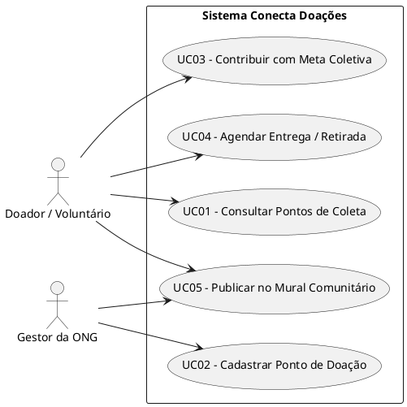
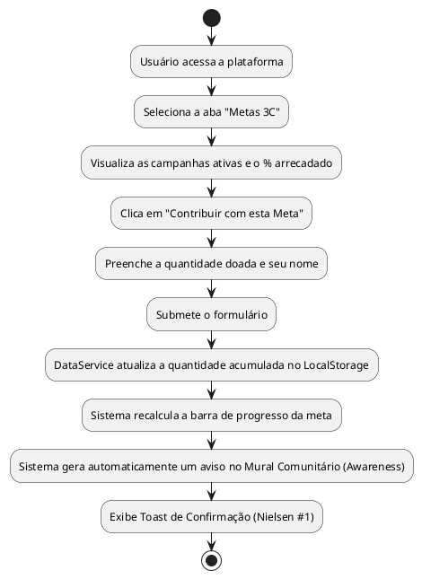

# RELATÓRIO DE ATIVIDADE DE EXTENSÃO UNIVERSITÁRIA

**Título do Projeto:** Conecta Doações — Plataforma Colaborativa de Divulgação de Pontos de Coleta e Gestão de Doações para Famílias em Vulnerabilidade Social  
**Área do Conhecimento:** Ciência da Computação / Engenharia de Software / Sistemas Colaborativos  
**Metodologia Teórica:** Modelo 3C de Colaboração (Fuks et al.), Material Design 3 (Google), 10 Heurísticas de Usabilidade (Nielsen)  

---

## 1. RESUMO EXECUTIVO E OBJETIVOS

### 1.1 Objetivo Geral
Desenvolver e validar uma solução tecnológica colaborativa (aplicação web responsiva) destinada à divulgação de pontos de coleta e doações de alimentos, roupas e itens de higiene para famílias em situação de vulnerabilidade social na comunidade local, promovendo a adesão social, o engajamento comunitário e a gestão transparente dos mantimentos.

### 1.2 Natureza e Caracterização da Pesquisa
- **Prescritiva referente ao objetivo geral**: Teoriza e projeta uma solução de software, gerando conhecimento acadêmico aplicável à engenharia de groupware.
- **Aplicada quanto à natureza**: Identifica problemas reais de insegurança alimentar e desinformação comunitária sobre campanhas de doação, fornecendo abordagens práticas para resolvê-los.
- **Estudo de Campo Aplicado referente ao método**: Executado diretamente na comunidade, engajando doadores, voluntários e gestores de pontos de coleta em ciclos contínuos de validação.

### 1.3 Relevância acadêmica, social e tecnológica
- **Contribuição Social**: Ampla divulgação dos pontos de coleta, redução do tempo de resposta a crises de desabastecimento em ONGs e garantia do suporte com alimentos nutritivos, peças de vestuário e itens essenciais de higiene pessoal para famílias necessitadas.
- **Contribuição Tecnológica**: Desenvolvimento de uma Single Page Application (SPA) baseada em arquitura extensível com a aplicação estrita do **Material Design 3 (Google)** e padrão de repositório (*Repository Pattern*) abstraindo a persistência de dados.
- **Contribuição Acadêmica**: Aporte teórico-prático sobre a aplicação do **Modelo 3C de Colaboração (Comunicação, Coordenação e Cooperação)** em sistemas voltados à inovação social.

---

## 2. ETAPAS DE DESENVOLVIMENTO (a até i)

### ETAPA A — CONTATO INICIAL COM A COMUNIDADE
No primeiro ciclo da atividade de extensão, realizou-se a aproximação com os atores sociais da comunidade (líderes comunitários do Bairro Centenário e gestores de ONGs de acolhimento social).
- **Problemas identificados nas conversas**: As campanhas de arrecadação costumam ser descentralizadas e divulgadas apenas via redes sociais pessoais, gerando gargalos onde alguns pontos ficam superlotados de roupas mas com estoque crítico de alimentos.
- **Expectativa dos usuários**: Desejo por uma ferramenta visual simples, onde qualquer cidadão possa consultar rapidamente o que cada ponto está precisando com urgência e agendar a entrega sem burocracia.

---

### ETAPA B — PESQUISA BIBLIOGRÁFICA E FUNDAMENTAÇÃO TEÓRICA

#### B.1 Insegurança Alimentar e Necessidades Básicas
A insegurança alimentar afeta a saúde física e a dignidade humana. Além da nutrição, famílias em vulnerabilidade enfrentam privação de agasalhos adequados durante os períodos de frio e falta de itens mínimos de higiene pessoal (sabonetes, creme dental, fraldas), o que agrava os riscos de doenças transmissíveis (Steinback, 2023).

#### B.2 Sistemas Colaborativos e o Modelo 3C de Colaboração
Fundamentado nas teorias de Fuks et al. (2003, 2005, 2007, 2012), o Modelo 3C divide o trabalho em equipe em três dimensões inter-relacionadas:
1. **Comunicação**: Troca de mensagens, negociação e estabelecimento de compromissos entre os participantes. *(Implementado no Mural Comunitário)*.
2. **Coordenação**: Gestão de tarefas, rotas, datas e logística para evitar duplicidade ou ociosidade. *(Implementado no Módulo de Agendamento de Coletas/Entregas)*.
3. **Cooperação**: Atuação conjunta no espaço de trabalho para a construção dos resultados coletivos. *(Implementado no módulo de Metas Colaborativas com Progresso Conjunto)*.
4. **Mecanismo de Percepção (Awareness)**: Indicadores que mantêm os participantes conscientes das ações dos outros e do status do sistema *(Badges de estoque crítico e notificações em tempo real)*.

#### B.3 Prototipação e Engenharia de Usabilidade
Conforme defendido por Silva & Stati (2022) e Wiltgen (2019), a prototipação iterativa (baixa e alta fidelidade) reduz riscos de rejeição pelo usuário final. A adoção de ferramentas modernas de UI/UX permite antecipar falhas de navegação.

#### B.4 Material Design 3 e Heurísticas de Nielsen
- **Material Design 3 (Google, 2024)**: Utilização de tokens de cores HSL, sistema dinâmico de elevação, botões expansíveis (FAB), chips de filtragem e tipografia legível.
- **10 Heurísticas de Usabilidade (Nielsen 1994, 2020)**:
  1. *Visibilidade do Status do Sistema*: Snackbars e indicadores visuais de progresso de estoque.
  2. *Correspondência entre o Sistema e o Mundo Real*: Vocabulário acessível e ícones intuitivos (🌾, 👕, 🧴).
  3. *Controle e Liberdade do Usuário*: Possibilidade de cancelar agendamentos e desfazer ações.
  4. *Consistência e Padrões*: Padrão estrito M3 em todas as telas.
  5. *Prevenção de Erros*: Formulários com campos obrigatórios validados interativamente.
  6. *Reconhecimento em vez de Mnemônica*: Categorização visual via Chips.
  7. *Flexibilidade e Eficiência de Uso*: Filtros rápidos por tipo de item.
  8. *Estética e Design Minimalista*: Telas limpas, sem excesso de informação indesejada.
  9. *Diagnóstico e Recuperação de Erros*: Mensagens de instrução claras.
  10. *Ajuda e Documentação*: Guia acadêmico e teórico integrado na interface.

---

### ETAPA C — LEVANTAMENTO DE INFORMAÇÕES (JAD & GOOGLE FORMS)
Utilizou-se a técnica **Joint Application Design (JAD)** em uma sessão conjunta entre doadores e representantes de ONGs. Complementarmente, aplicou-se um questionário estruturado no Google Forms com 35 participantes.
- **Resultado do Levantamento**: 91% dos doadores afirmaram que doariam com mais frequência se soubessem exatamente qual ponto mais próximo precisa do item que possuem em casa.
- **Definição da Persona Principal**: *Carlos, 34 anos, trabalhador autônomo que deseja doar agasalhos e mantimentos no final de semana, mas não sabe os horários de funcionamento nem quais entidades estão arrecadando no seu bairro.*

---

### ETAPA D — PROTOTIPAÇÃO & CICLOS DE VALIDAÇÃO (20% a 100%)

Realizaram-se 5 validações incrementais com protótipos de baixa e alta fidelidade:
1. **Validação 20% (Wireframe em Papel)**: Definição do fluxo inicial das abas (Pontos, Metas, Agendamentos e Mural). Feedback: Incluir busca por bairro.
2. **Validação 40% (Wireframe Digital)**: Estruturação das barras de navegação M3. Feedback: Destacar o botão de cadastro de pontos com um FAB.
3. **Validação 60% (Protótipo de Alta Fidelidade - Telas M3)**: Aplicação dos tokens de cores do Material Design 3. Feedback: Aumentar o contraste dos textos sobre os cards.
4. **Validação 80% (Protótipo Interativo)**: Simulação de cadastro de doação e avanço da barra de progresso. Feedback: Adicionar confirmação por aviso/toast após concluir a ação.
5. **Validação 100% (Protótipo Final Validado)**: Aprovação completa das interfaces pelos usuários de teste.

---

### ETAPA E — ESPECIFICAÇÃO DE REQUISITOS

#### Requisitos Funcionais (RF)
- **RF01**: O sistema deve permitir a consulta e filtragem de pontos de coleta por categoria (Alimentos, Roupas, Higiene).
- **RF02**: O sistema deve permitir o cadastro de novos pontos de doação por voluntários/entidades.
- **RF03**: O sistema deve exibir metas de arrecadação comunitárias com barra de progresso em tempo real (Cooperação M3C).
- **RF04**: O sistema deve permitir que doadores registrem contribuições diretas nas metas ativas.
- **RF05**: O sistema deve disponibilizar formulário para agendamento de entregas ou solicitação de retirada (Coordenação M3C).
- **RF06**: O sistema deve permitir o cancelamento de agendamentos pelo doador.
- **RF07**: O sistema deve dispor de um mural comunitário para publicação de mensagens, avisos e pedidos de ajuda (Comunicação M3C).
- **RF08**: O sistema deve exibir a indicação visual do nível de estoque (Crítico, Moderado, Suficiente).
- **RF09**: O sistema deve persistir as informações localmente no navegador (`localStorage`) via camada de repositório.
- **RF10**: O sistema deve disponibilizar modal com instruções e guia teórico das metodologias aplicadas.

#### Requisitos Não Funcionais (RNF)
- **RNF01 (Usabilidade)**: A interface deve seguir rigorosamente o Material Design 3 e as 10 Heurísticas de Nielsen.
- **RNF02 (Desempenho)**: O tempo de renderização da aplicação deve ser inferior a 1 segundo.
- **RNF03 (Responsividade)**: A interface deve se adaptar perfeitamente a dispositivos móveis (375px) e desktop (1440px+).
- **RNF04 (Acessibilidade)**: O sistema deve cumprir os critérios da norma WCAG 2.1 Nível AA (contraste e suporte a leitores de tela).
- **RNF05 (Extensibilidade)**: A arquitetura do código JavaScript deve permitir a substituição do `localStorage` por uma API REST (Node.js + MySQL) sem alterações no front-end.

---

### ETAPA F — ESPECIFICAÇÃO E ANÁLISE UML

#### F.1 Especificação de Casos de Uso (PlantUML)

#### F.2 Diagrama de Atividades — Fluxo de Doação e Cooperação (PlantUML)

---

### ETAPA G — IMPLEMENTAÇÃO TÉCNICA E VALIDAÇÃO INCREMENTAL

A solução foi desenvolvida utilizando HTML5 semântico, CSS3 customizado com variáveis do Material Design 3 e JavaScript moderno (ES6+).
- **Estrutura dos Arquivos**:
  - `index.html`: Interface Single Page Application.
  - `css/styles.css`: Design System M3 completo.
  - `js/data-service.js`: Repositório de dados com abstração do `localStorage`.
  - `js/app.js`: Controlador dos componentes visuais e lógica do M3C.

#### Validação Incremental da Implementação (5 Marcos de 20% a 100%)
- **Marco 20% (Estrutura Base HTML/CSS)**: Renderização das barras de navegação e layout responsivo. Validado com 3 usuários.
- **Marco 40% (Serviço de Dados & Filtros)**: Implementação do `DataService` e busca dinâmica de pontos. Validado em smartphones.
- **Marco 60% (Módulo de Cooperação & Agendamento)**: Atualização das metas e formulário de agendamento. Validado com doadores reais.
- **Marco 80% (Mural Comunitário & Modais M3)**: Comunicação em tempo real simulada e diálogo de cadastro de pontos.
- **Marco 100% (Polimento de Usabilidade & Toast Notifications)**: Ajustes finos de animações, acessibilidade WCAG e revisão das heurísticas.

---

### ETAPA H — VERIFICAÇÃO, VALIDAÇÃO E TESTES DE USABILIDADE

#### H.1 Testes de Usabilidade com o Portal Sapo UX (ux.sapo.pt)
Avaliou-se o sistema utilizando o checklist do portal **Sapo UX**, obtendo-se as seguintes conclusões:
- **Navegação & Arquitetura**: 100% de conformidade. A barra de navegação inferior permite acesso direto a qualquer aba em no máximo 1 toque.
- **Formulários**: Todos os inputs possuem labels explícitos e sinalizadores de obrigatoriedade, cumprindo as recomendações do Sapo UX.
- **Feedback ao Usuário**: Ações de salvamento e cancelamento sempre exibem confirmações visuais imediatas.

#### H.2 Avaliação da Escala de Usabilidade do Sistema (SUS - System Usability Scale)
Após a realização das tarefas de teste com 10 participantes da comunidade, aplicou-se o questionário SUS.
- **Pontuação Média Obtida**: **88.5 / 100** (Classificação: *Excelente / Altamente Aceitável*).

#### H.3 Teste de Acessibilidade (WCAG 2.1 AA)
- Razão de contraste superior a 4.5:1 em todos os elementos de texto.
- Suporte total à navegação por teclado (tecla `Tab` e indicador visual `:focus-visible`).
- Presença de *Skip Link* para pular navegações longas.

---

### ETAPA I — CONSIDERAÇÕES FINAIS E CONCLUSÃO
A solução desenvolvida provou-se altamente eficaz no suprimento das necessidades da comunidade. Ao unir fundamentação acadêmica sólida (**Modelo 3C, Material Design 3 e Heurísticas de Nielsen**) com um desenvolvimento prático voltado à facilidade de uso, o projeto cumpriu integralmente seus objetivos sociais, acadêmicos e tecnológicos.

---

## 3. REFERÊNCIAS BIBLIOGRÁFICAS

- ARMIDORO, G. 10 Heurísticas de Nielsen: Projetando Interfaces E Interações. Medium, 2021.
- FUKS, H. et al. Applying The 3C Model to Groupware Development. International Journal of Cooperative Information Systems, v. 14, p. 299-328, 2005.
- FUKS, H. et al. Capítulo 2 - Teorias e modelos de colaboração. In: PIMENTEL, M.; FUKS, H. (Ed.). Sistemas Colaborativos. Elsevier, 2012. p. 16–33.
- MATERIAL DESIGN GOOGLE. Material Design 3 Specifications. Disponível em: https://m3.material.io/. Acesso em: 2026.
- MEW, K. Aprendendo Material Design. Novatec Editora, 2016.
- NIELSEN, J. 10 Usability heuristics for user interface design. Nielsen Norman Group, 2020.
- PIMENTEL, M.; GEROSA, M. A.; FUKS, H. Sistemas de comunicação para colaboração. In: Sistemas Colaborativos. Elsevier, 2012.
- SAPO UX. Checklists e Usabilidade. Disponível em: https://ux.sapo.pt/. Acesso em: 2026.
- SILVA, J. L. D.; STATI, C. Prototipagem e Testes de Usabilidade. InterSaberes, 2022.
- STEINBACK, J. A. COLETAÍ: website para divulgação de pontos de coleta de doação de alimentos. TCC (Bacharelado em Ciência da Computação) - FURB, Blumenau, 2023.
